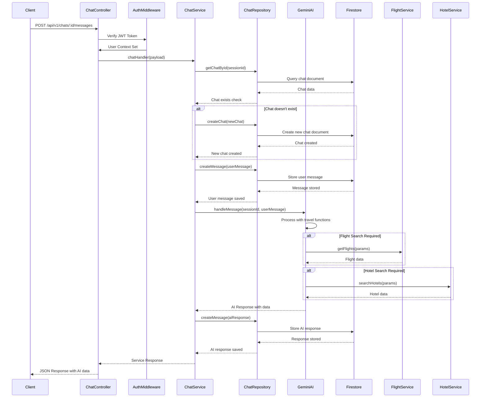

# 🤖 Gen AI Trip Planner Backend

A comprehensive **AI-powered travel planning backend** built with modern technologies including **Hono.js**, **Firebase Firestore**, **Google Gemini AI**, and a robust **Controller-Service-Repository** architecture pattern.

## � Key Features

- 🤖 **AI-Powered Chat System** with Google Gemini AI integration
- 🔐 **JWT Authentication** with Firebase ID token verification
- ✈️ **Flight Search** with real-time API integration
- 🏨 **Hotel Search** with comprehensive filtering
- 📊 **Advanced Logging** with Firebase Firestore storage
- 🔒 **Type-Safe APIs** with Zod validation
- 🎯 **Clean Architecture** with separation of concerns

## �🏗️ Project Architecture Overview

This project follows a **layered microservices architecture** with clear separation of concerns:

```
┌─────────────────────────────────────────────────────────────┐
│                    🌐 HTTP Layer (Hono.js)                  │
├─────────────────┬─────────────────┬─────────────────────────┤
│  User Module    │  Chat Module    │   Itinerary Module      │
│  🎮 Controllers │  🎮 Controllers │   🎮 Controllers        │
│  🔧 Services    │  🔧 Services    │   🔧 Services           │
│  💾 Repository  │  💾 Repository  │   💾 Repository         │
├─────────────────┴─────────────────┴─────────────────────────┤
│              🛠️ Utilities & Middleware Layer                │
│   🔐 Auth • 📊 Logger • 🎫 Token • 📨 Response • 🔒 Crypto  │
├─────────────────────────────────────────────────────────────┤
│                🗄️ Database Layer (Firebase)                 │
│    📄 Firestore • 🔑 Authentication • ☁️ Cloud Services     │
└─────────────────────────────────────────────────────────────┘
```

## 📁 Comprehensive Project Structure

```
Gen-AI-Trip-Planner-Backend/
├── 📦 package.json                # Dependencies & Scripts
├── 🔧 tsconfig.json              # TypeScript Configuration  
├── 🎨 eslint.config.ts           # ESLint Configuration
├── 🎨 .prettierrc                # Code Formatting Rules
├── 🌐 .prettierignore            # Prettier Ignore Patterns
├── 🙈 .gitignore                 # Git Ignore Rules
├── 📖 README.md                  # Project Documentation
│
├── src/                          # 🚀 Main Source Directory
│   ├── main.ts                   # 🚀 Application Entry Point
│   ├── app.ts                    # 🔧 Hono App Configuration
│   │
│   ├── bin/                      # 🌐 Server Binaries
│   │   └── http.ts               # HTTP Server Setup
│   │
│   ├── config/                   # 🔐 Configuration Files
│   │   ├── .env                  # Environment Variables
│   │   └── gcp-service-account.json # Firebase Service Account
│   │
│   ├── db/                       # 🗄️ Database Configuration
│   │   └── db.ts                 # Firebase Firestore Connection
│   │
│   ├── router/                   # 🛣️ API Routing
│   │   ├── index.ts              # Main Router Hub
│   │   └── api.v1.ts             # API v1 Routes & Middleware
│   │
│   ├── modules/                  # 📂 Feature Modules
│   │   ├── User/                 # 👤 User Management
│   │   │   ├── user.router.ts    # User Route Definitions
│   │   │   ├── user.http.ts      # User Controllers
│   │   │   ├── user.service.ts   # User Business Logic
│   │   │   └── user.schema.ts    # User Validation Schemas
│   │   │
│   │   ├── Chat/                 # 💬 AI Chat System
│   │   │   ├── chat.router.ts    # Chat Route Definitions
│   │   │   ├── chat.http.ts      # Chat Controllers
│   │   │   ├── chat.service.ts   # Chat Business Logic + AI Integration
│   │   │   ├── chat.repository.ts # Chat Data Access Layer
│   │   │   └── chat.schema.ts    # Chat Validation Schemas
│   │   │
│   │   ├── Itenary/              # 🗺️ Trip Planning AI
│   │   │   └── itenary.service.ts # Google Gemini AI Integration
│   │   │
│   │   ├── Flight/               # ✈️ Flight Search
│   │   │   └── flight.service.ts # Flight API Integration
│   │   │
│   │   └── Hotel/                # 🏨 Hotel Search
│   │       └── hotel.service.ts  # Hotel API Integration
│   │
│   └── utils/                    # 🛠️ Utility Functions
│       ├── authMiddleware.ts     # 🔐 JWT Authentication Middleware
│       ├── logger.ts             # 📊 Firebase Logger System
│       ├── response.ts           # 📨 Standardized API Responses
│       ├── tokenHelper.ts        # 🎫 JWT Token Management
│       ├── config.ts             # ⚙️ Configuration Management
│       ├── aesEncrypt.ts         # 🔒 Encryption Utilities
│       ├── uploadHelper.ts       # 📁 File Upload Utilities
│       ├── helper.ts             # 🛠️ General Helper Functions
│       ├── makeRequest.ts        # � HTTP Request Utilities
│       └── mailer.ts             # 📧 Email Service Integration
## 🚀 Application Flow & Architecture

### 1. **🔥 Application Bootstrap: `src/main.ts`**
```typescript
// Load environment configuration
import { config } from "dotenv";
config({ path: join(process.cwd(), "src/config/.env") });

// Initialize HTTP server
import { listen as HttpListen } from "./bin/http.js";
## 🗄️ Database Architecture

### **Firestore Collections Structure**
```
📁 Firestore Database
├── 📂 chats/                     # Chat sessions
│   └── {chatId}/
│       ├── id: string            # Unique chat identifier
│       ├── user_id: string       # Owner user ID
│       ├── last_message: string  # Last message preview
│       └── timestamp: number     # Creation timestamp
│
├── 📂 messages/                  # Chat messages (flat collection)
│   └── {messageId}/
│       ├── id: string            # Unique message ID
│       ├── chat_id: string       # Reference to parent chat
│       ├── sender: "user"|"model" # Message sender type
│       ├── text: string          # Message content
│       ├── attachment?: string   # Optional file URL
│       ├── delivery_status: enum # Message delivery status
│       └── timestamp: number     # Message timestamp
│
├── 📂 users/                     # User profiles
│   └── {userId}/
│       ├── email: string         # User email
│       ├── name?: string         # Display name
│       ├── createdAt: timestamp  # Account creation
│       └── lastLoginAt: timestamp # Last login time
│
└── 📂 logs/                      # Application logs
    └── {logId}/
        ├── level: string         # Log level (info/error/warn)
        ├── module: string        # Source module
        ├── message: string       # Log message
        ├── data?: object         # Additional log data
        └── timestamp: timestamp  # Log timestamp
```

### **🔍 Query Optimization**
```typescript
// Optimized chat queries with proper indexing
const chatsQuery = db.collection("chats")
  .where("user_id", "==", userId)
  .orderBy("timestamp", "desc")
  .limit(limit);

// Message pagination with cursor-based approach
const messagesQuery = db.collection("messages")
  .where("chat_id", "==", chatId)
  .orderBy("timestamp", "desc")
  .startAfter(cursor)
  .limit(limit + 1); // +1 to check hasMore
```

## 🎯 API Endpoints Overview

### **🔓 Public Endpoints**
```http
GET  /api/v1                      # Health check
POST /api/v1/users/verify-token   # Firebase token verification
POST /api/v1/users/register       # User registration
```

### **🔒 Protected Endpoints (JWT Required)**

#### **💬 Chat Management**
```http
GET  /api/v1/chats                # Get all user chats (paginated)
GET  /api/v1/chats/:id            # Get specific chat with messages
POST /api/v1/chats                # Create new chat session
POST /api/v1/chats/:id/messages   # Send message & get AI response
```

#### **Request/Response Examples**

**Create Chat:**
```json
POST /api/v1/chats
Authorization: Bearer <jwt_token>
Content-Type: application/json

{
  "id": "chat_12345",
  "user_id": "user_67890",
  "initial_message": "Plan a trip to Tokyo"
}
```

**Send Message & Get AI Response:**
```json
POST /api/v1/chats/chat_12345/messages
Authorization: Bearer <jwt_token>
Content-Type: application/json

{
  "sessionId": "chat_12345",
  "userMessage": "Find flights from NYC to Tokyo for December 15th, 2025",
  "userId": "user_67890"
}

// Response
{
  "error": false,
  "statusCode": 200,
  "message": "Message processed successfully",
  "data": {
    "reply": "I found several flights from NYC to Tokyo...",
    "flights": [...],
    "done": false
  }
}
```

## 🛠️ Development Workflow

### **Code Quality & Formatting**
```bash
# 🎨 Format code with Prettier
npm run format

# 🔍 Check formatting
npm run format:check

# 🧹 Lint TypeScript code
npm run lint

# 🔧 Auto-fix linting issues
npm run lint:fix

# 🚀 Format + Lint in one command
npm run lint:format
```

### **Development Scripts**
```json
{
  "scripts": {
    "dev": "npx nodemon --exec tsx src/main.ts",    // 🔄 Development server
    "start": "tsx src/main.ts",                     // 🚀 Production start
    "build": "tsc",                                 // 📦 TypeScript compilation
    "start:prod": "node dist/main.js"               // 🏭 Production server
  }
}
```

### **ESLint Configuration Features**
- ✅ **Underscore Variables**: Variables prefixed with `_` are ignored (e.g., `_unusedVar`)
- ✅ **TypeScript Support**: Full TypeScript linting with strict rules
- ✅ **Node.js Globals**: Proper `process`, `console`, globals configuration
- ✅ **Modern Syntax**: ES2020+ features support

## 🔧 Environment Configuration

### **Required Environment Variables**
```bash
# 🔗 Server Configuration
PORT=3000
NODE_ENV=development

# 🔑 Firebase Configuration
FIREBASE_PROJECT_ID=your-project-id
FIREBASE_PRIVATE_KEY=your-private-key
FIREBASE_CLIENT_EMAIL=your-service-account-email

# 🤖 AI Configuration
GOOGLE_AI_API_KEY=your-gemini-api-key

# 🛠️ External APIs
FLIGHT_API_KEY=your-flight-api-key
HOTEL_API_KEY=your-hotel-api-key

# 🔐 JWT Configuration
JWT_SECRET=your-jwt-secret-key
JWT_EXPIRY=7d
```

## 🚀 Getting Started

### **1. Installation**
```bash
# Clone repository
git clone <repository-url>
cd Gen-AI-Trip-Planner-Backend

# Install dependencies
npm install
```

### **2. Configuration**
```bash
# Create environment file
cp src/config/.env.example src/config/.env

# Add your Firebase service account JSON
# Place file at: src/config/gcp-service-account.json
```

### **3. Development**
```bash
# Start development server with hot reload
npm run dev

# Server will be available at http://localhost:3000
```

### **4. Production**
```bash
# Build for production
npm run build

# Start production server
npm run start:prod
```

## 🧪 Testing

### **Manual API Testing**
Use the provided HTTP files for manual testing:
```bash
# Example HTTP request files
api/user.http          # User authentication tests
api/chat.http          # Chat functionality tests
```

### **Health Check**
```bash
curl http://localhost:3000/api/v1
# Response: {"status":"ok","time":"2025-09-21T10:30:00.000Z"}
```

## 🔄 Technology Stack

### **Core Technologies**
- 🟦 **TypeScript 5.8+**: Type-safe development
- 🔥 **Hono.js 4.9+**: Modern web framework for edge
- 🗄️ **Firebase Firestore**: NoSQL document database
- 🤖 **Google Gemini AI**: Advanced AI integration
- 🎯 **Zod 4.1+**: Runtime type validation

### **Development Tools**
- 🎨 **Prettier 3.0+**: Code formatting
- 🔍 **ESLint 9.35+**: Code linting with TypeScript support
- 🔄 **Nodemon**: Development server auto-reload
- ⚡ **TSX**: Fast TypeScript execution

### **External Integrations**
- ✈️ **Flight APIs**: Real-time flight search
- 🏨 **Hotel APIs**: Hotel booking integration
- 📧 **Email Services**: Notification system
- 🔐 **JWT**: Secure authentication tokens

## 📚 API Response Standards

### **Success Response Format**
```json
{
  "error": false,
  "statusCode": 200,
  "message": "Operation successful",
  "data": { /* response data */ }
}
```

### **Error Response Format**
```json
{
  "error": true,
  "statusCode": 400,
  "message": "Operation failed",
  "errors": ["Detailed error message"]
}
```

### **Pagination Response Format**
```json
{
  "error": false,
  "statusCode": 200,
  "message": "Data retrieved successfully",
  "data": {
    "items": [...],
    "pagination": {
      "page": 1,
      "limit": 20,
      "total": 100,
      "total_pages": 5,
      "has_next": true,
      "has_previous": false
    }
  }
}
```

---

## 🤝 Contributing

1. **Fork** the repository
2. **Create** a feature branch (`git checkout -b feature/amazing-feature`)
3. **Commit** your changes (`git commit -m 'Add amazing feature'`)
4. **Push** to the branch (`git push origin feature/amazing-feature`)
5. **Open** a Pull Request

## 📄 License

This project is licensed under the MIT License - see the [LICENSE](LICENSE) file for details.

---

**Built with ❤️ for modern AI-powered travel planning**
HttpListen(PORT);
```

**Bootstrap Sequence:**
1. 🔧 Load environment variables from `src/config/.env`
2. 🌐 Initialize Firebase Admin SDK with service account
3. � Start HTTP server with configured port
4. 📊 Initialize logging system with Firestore integration

### 2. **🌐 HTTP Server: `src/bin/http.ts`**
```typescript
export function listen(port?: number) {
    logger.info({ 
        message: `✅Server is running on port ${port ?? 3000}`,
        module: "HTTP Server", 
        skipDb: true 
    });
    serve({ fetch: app.fetch, port: port ?? 3000 });
}
```

### 3. **🔧 App Configuration: `src/app.ts`**
```typescript
const app = new Hono();

// Global middleware
app.use("*", logger());
app.use("*", cors({ origin: "*" }));

// API routing
app.route("/", rootRouter);

// Global error handler
app.onError((err, c) => {
    const response = new ApiResponse(c);
    return response.exception(err);
});
```

## � AI Chat System Architecture

### **Chat Response Generation Flow**



### **🤖 AI Integration Components**

#### **1. Travel Assistant (`itenary.service.ts`)**
```typescript
export function createTravelAssistant() {
  const genAI = new GoogleGenAI(process.env.GOOGLE_AI_API_KEY!);
  const model = genAI.getGenerativeModel({
    model: "gemini-1.5-flash",
    tools: [flightTool, hotelTool], // Function calling tools
    toolConfig: { functionCallingConfig: { mode: "AUTO" } }
  });

  return {
    async handleMessage(sessionId: string, message: string) {
      // Process with AI and execute function calls
      const result = await model.generateContent({
        contents: [{ role: "user", parts: [{ text: message }] }]
      });
      
      return this.processResponse(result);
    }
  };
}
```

#### **2. Function Calling Tools**
- **✈️ Flight Search Tool**: Integrates with flight APIs for real-time data
- **� Hotel Search Tool**: Connects to hotel booking services
- **�️ Itinerary Planning**: AI-powered trip optimization

## 🔐 Authentication & Authorization System

### **JWT Authentication Flow**
```typescript
// authMiddleware.ts
export const jwtAuthMiddleware = async (c: Context, next: Next) => {
  const authHeader = c.req.header("Authorization");
  const token = authHeader?.split(" ")[1]; // Extract Bearer token
  
  const [verifyErr, payload] = verifyJwtToken(token);
  if (verifyErr) throw new HTTPException(401, { message: "Invalid token" });
  
  c.set("userId", payload.uuid);
  c.set("userEmail", payload.email);
  await next();
};
```

### **Protected Routes Structure**
```typescript
// api.v1.ts
apiV1.route("/users", UserRouter);                    // Public user routes
apiV1.route("/chats", ChatRouter);                   // 🔒 Protected chat routes

// All chat routes require JWT authentication
```

## 📊 Advanced Logging System

### **Firebase Logger Integration**
```typescript
// logger.ts
export const logger = {
  async info(entry: LogEntry) {
    // Console logging for development
    console.log(`[${entry.level.toUpperCase()}]`, entry.message);
    
    // Firebase Firestore logging for production
    if (!entry.skipDb) {
      await db.collection("logs").add({
        ...entry,
        timestamp: Timestamp.now(),
        environment: process.env.NODE_ENV
      });
    }
  }
};
```

### **Structured Logging Format**
```typescript
interface LogEntry {
  level: "info" | "debug" | "warn" | "error";
  module: string;
  message: string;
  data?: Record<string, unknown>;
  error?: Error | string;
  timestamp?: Timestamp;
  skipDb?: boolean;
}
```
const app = new Hono();

// Middleware Stack
app.use(logger());           // 📊 Request logging
app.use("*", cors());        // 🌐 CORS handling
app.use(secureHeaders());    // 🔒 Security headers
app.use(compress());         // 🗜️ Response compression

// Route mounting
app.route("/api", HttpRouter.apiRouter);

// Static file serving
app.use("*", etag());
app.use("/*", serveStatic({ root: "./public" }));
```

## 🔧 Configuration & Environment Loading

### Environment Variables (`src/config/.env`)
```env
NODE_ENV=prod
CRYPTO_SECRET=456
SECRET=123
PORT=3000
```

### Configuration Management (`src/utils/config.ts`)
- 🔍 **Zod validation** for environment variables
- 🔐 **Type-safe configuration** access
- 📁 **Service account loading** from JSON files
- ⚠️ **Error handling** for missing configurations

```typescript
const EnvConfigSchema = z.object({
    NODE_ENV: z.string(),
    CRYPTO_SECRET: z.string(),
    SECRET: z.string(),
    PORT: z.string(),
});
```

## 🛣️ Routing Architecture

### Route Hierarchy
```
app
└── /api (HttpRouter.apiRouter)
    └── /v1 (apiV1)
        ├── / (Health check)
        └── /users (UserRouter)
            └── /create (POST)
```

### 1. **Main Router Hub (`src/router/index.ts`)**
```typescript
const apiRouter = new Hono();
apiRouter.route("/v1", apiV1);
export default { apiRouter };
```

### 2. **API v1 Router (`src/router/api.v1.ts`)**
```typescript
const apiV1 = new Hono();

// Health check endpoint
apiV1.get("/", async (c) => {
    return c.json({ status: "ok", time: new Date().toISOString() });
});

// Module routing
apiV1.route("/users", UserRouter);

// Global error handling
apiV1.onError((err, c) => {
    if (err instanceof HTTPException) return err.getResponse();
    const response = new ApiResponse(c);
    return response.exception(err);
});
```

### 3. **Module Router (`src/modules/User/user.router.ts`)**
```typescript
const UserRouter = new Hono();
import * as UserController from "./user.http.js";

// Route definitions
UserRouter.post("/create", UserController.handleCameraStreamDetails);
```

## 🏛️ Controller-Service-Repository Architecture

### **Controller Layer** (`user.http.ts`)
**Responsibility:** Handle HTTP requests/responses, input validation, error formatting

```typescript
export async function handleCameraStreamDetails(c: Context) {
    const response = new ApiResponse(c);
    try {
        const body = await c.req.json();                    // 📥 Extract request data
        const handle = await UserService.createUser(body); // 🔄 Delegate to service
        return response.json(handle);                       // 📤 Format response
    } catch (err) {
        return response.exception(err);                     // ⚠️ Handle errors
    }
}
```

### **Service Layer** (`user.service.ts`)
**Responsibility:** Business logic, data validation, orchestration

```typescript
export async function createUser(payload: CreateUserPayload): Promise<ServiceResponse<unknown>> {
    // 🔍 Validate input with Zod schema
    const verify = CreateUserPayloadSchema.safeParse(payload);
    if (!verify.success) {
        return ServiceResponse.success(null, "Invalid payload", { statusCode: 400 });
    }
    
    // 💾 Delegate to repository
    const [userErr, user] = await UserRepository.createUser(verify.data);
    
    if (userErr) {
        // 📊 Log error
        logger.error({
            message: "Error in createUser",
            module: MODULE,
            error: userErr,
        });
        return ServiceResponse.error([], userErr.message, { statusCode: 500 });
    }
    
    // 📊 Log success
    logger.info({
        message: "User created successfully",
        module: MODULE,
        data: user,
    });
    
    return ServiceResponse.success({ user }, "User created successfully");
}
```

### **Repository Layer** (`user.repository.ts`)
**Responsibility:** Pure data access, database operations

```typescript
export async function createUser(payload: CreateUserPayload): Promise<ErrorFirstResponse<unknown>> {
    try {
        const user = await db.collection("users").add(payload); // 💾 Firebase operation
        return ErrorFirstResponse.success(user);               // ✅ Success response
    } catch (error) {
        return ErrorFirstResponse.error(error as Error);       // ❌ Error response
    }
}
```

### **Schema Layer** (`user.schema.ts`)
**Responsibility:** Data validation and type definitions

```typescript
export const CreateUserPayloadSchema = z.object({
    email: z.string().email(),
    name: z.string().min(2).max(100),
});

export type CreateUserPayload = z.infer<typeof CreateUserPayloadSchema>;
```

## 🗄️ Database Integration

### Firebase Firestore Setup (`src/db/db.ts`)
```typescript
import { initializeApp, cert } from "firebase-admin/app";
import { getFirestore } from "firebase-admin/firestore";
import { readFileSync } from "node:fs";
import { join } from "node:path";

// Load and validate service account
const serviceAccountData = JSON.parse(
    readFileSync(join(process.cwd(), "src/config/gcp-service-account.json"), "utf-8")
);

// Initialize Firebase Admin
initializeApp({
    credential: cert(serviceAccount as ServiceAccount),
});

// Export Firestore instance
const db = getFirestore();
export default db;
```

### GCP Service Account Validation
- 🏗️ **Zod schema validation** for service account structure
- 🔐 **Type-safe** Firebase configuration
- ⚠️ **Error handling** for invalid credentials

## 📊 Advanced Logger System

### Firebase Logger Features (`src/utils/logger.ts`)
- 🔄 **Singleton pattern** for consistent logging
- 🌐 **Dual logging**: Console (immediate) + Firebase (background)
- 📝 **Structured logging** with module identification
- 🚫 **Selective database logging** with `skipDb` option

### Logger Interface
```typescript
interface LogParams {
    module: string;        // 🏷️ Module identifier
    message: string;       // 📝 Log message
    error?: Error | string;// ⚠️ Optional error details
    data?: unknown;        // 📊 Optional additional data
    skipDb?: boolean;      // 🚫 Skip Firebase logging (default: false)
}
```

### Usage Examples
```typescript
// Regular logging (saves to Firebase)
logger.info({
    module: "Auth",
    message: "User login successful",
    error: "user_id: 12345"
});

// Console-only logging (skipDb: true)
logger.debug({
    module: "Performance",
    message: "Request processed",
    error: "duration: 150ms",
    skipDb: true  // 🚫 Only console, no Firebase
});

// Batch logging
logger.logBatch([
    { level: "info", module: "Process", message: "Started" },
    { level: "debug", module: "Process", message: "Step 1", skipDb: true }
]);
```

### Log Storage Structure (Firebase)
```typescript
interface LogEntry {
    level: "info" | "debug" | "warn" | "error";
    module: string;
    message: string;
    error?: string;        // Stack trace for Error objects
    timestamp: Timestamp;  // Firebase server timestamp
}
```

## 📨 Response Management System

### Standardized Response Types (`src/utils/response.ts`)

#### **ServiceResponse** (Service Layer)
```typescript
export class ServiceResponse<T> {
    static success<T>(data: T, message: string, options?: { statusCode?: number }): SuccessServiceResponse<T>
    static error<E>(errors: E, message: string, options?: { statusCode?: number }): ErrorServiceResponse<E>
}
```

#### **ErrorFirstResponse** (Repository Layer)
```typescript
export class ErrorFirstResponse<T> {
    static success<T>(data: T): [null, T]
    static error(error: Error): [Error, null]
}
```

#### **ApiResponse** (Controller Layer)
```typescript
export class ApiResponse {
    json(serviceResponse: ServiceResponse<any>): Response
    exception(error: unknown): Response
    stream(readable: Readable): Response
}
```

### Response Flow
```
Repository → [Error, Data] → Service → ServiceResponse → Controller → ApiResponse → HTTP
```

## 🔐 Security & Utilities

### Available Utilities
- 🔒 **AES Encryption** (`aesEncrypt.ts`) - Data encryption/decryption
- 🎫 **JWT Management** (`tokenHelper.ts`) - Token creation/validation
- 📁 **File Uploads** (`uploadHelper.ts`) - File handling utilities
- 🌐 **HTTP Requests** (`makeRequest.ts`) - External API calls
- 📧 **Email Services** (`mailer.ts`) - Email sending capabilities
- 🛠️ **General Helpers** (`helper.ts`) - Common utility functions

### Security Middleware Stack
1. 🔒 **Secure Headers** - Security-focused HTTP headers
2. 🌐 **CORS** - Cross-origin resource sharing
3. 🗜️ **Compression** - Response compression
4. 🏷️ **ETag** - HTTP caching headers

## 🛠️ Development Setup

### Prerequisites
- **Node.js** (v18+)
- **Yarn** package manager
- **Firebase Project** with Firestore enabled

### Installation & Setup

1. **Clone and Install**
```bash
git clone <repository-url>
cd Gen-AI-Trip-Planner-Backend
yarn install
```

2. **Environment Configuration**
Create `src/config/.env`:
```env
NODE_ENV=development
PORT=4000
CRYPTO_SECRET=your-crypto-secret
SECRET=your-jwt-secret
```

3. **Firebase Setup**
Place your `gcp-service-account.json` in `src/config/`

4. **Start Development Server**
```bash
yarn dev          # Development with hot reload
yarn start        # Production mode
yarn build        # Build TypeScript
```

### Available Scripts
```json
{
    "dev": "npx nodemon --exec tsx src/main.ts",      // 🔄 Hot reload development
    "start": "tsx src/main.ts",                      // 🚀 Production start
    "build": "tsc",                                  // 🏗️ TypeScript compilation
    "start:prod": "node dist/main.js"               // 🎯 Built app execution
}
```

## 🧪 API Testing

### HTTP Test Files (`api/user.http`)
VS Code REST Client compatible test files for API endpoints.

### Test Endpoints
```http
### Health Check
GET http://localhost:4000/api/v1/

### Create User
POST http://localhost:4000/api/v1/users/create
Content-Type: application/json

{
    "email": "user@example.com",
    "name": "John Doe"
}
```

## 📋 Key Features

### ✅ **Architecture Benefits**
- 🏗️ **Clean Architecture** - Clear separation of concerns
- 🔧 **Type Safety** - Full TypeScript implementation
- 🔍 **Input Validation** - Zod schema validation
- 📊 **Comprehensive Logging** - Firebase + Console logging
- ⚡ **Performance** - Hono.js lightweight framework
- 🔐 **Security** - Built-in security middleware
- 🧪 **Testability** - Modular, dependency-injected architecture

### ✅ **Production Ready**
- 🔄 **Error Handling** - Comprehensive error management
- 📊 **Monitoring** - Structured logging to Firebase
- 🔒 **Security** - Multiple security layers
- 🗜️ **Optimization** - Response compression and caching
- 📁 **Static Files** - Built-in static file serving
- 🌐 **CORS** - Cross-origin request handling

## 🤝 Contributing

1. Follow the established **Controller-Service-Repository** pattern
2. Use **Zod schemas** for all data validation
3. Implement proper **error handling** with the response utilities
4. Add **comprehensive logging** with appropriate module identification
5. Write **type-safe** code with TypeScript
6. Follow the **naming conventions** (no camelCase for routes)

## 📜 License

This project is private and proprietary.

---

**🚀 Happy Coding!** This architecture provides a robust, scalable foundation for building modern backend applications with TypeScript, Hono.js, and Firebase.
# gen-ai-travel-backend
